# CI2024_project-work
## Lab4 - Project Work

The Project Work goal is implementing a Genetic Programming (GP) algorithm for the [Symbolic Regression](https://en.wikipedia.org/wiki/Symbolic_regression), that is, an evolutionary method that tries to find a mathematical function that best approximates a set of data. The algorithm relies on parse trees to represent mathematical expressions.

### Loading Data and Tree Node Definition
The main object is the `Node` class, which represents a node in the tree. The `value` of each node can be:
- a constant (number);
- a variable (e.g. x0, x1);
- a binary operator (e.g. +, -, *, /).
- an unary operator (e.g. sin, cos, log10).

The `is_leaf()` function returns true if the node does not have any child (it is a leaf).

### Node Evaluation

The `evaluate(node, x)`function computes the numerical value of a mathematical expression represented as a parse tree, given an input vector `x`, which contains the values set for each variable.

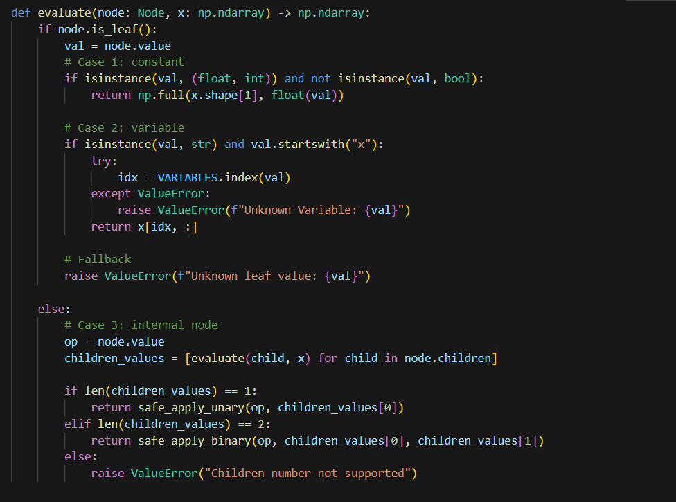

### Protected Operators and Parameters Settings

This section shows some safe functions, which allow to apply mathematical functions safely on the input vectors:

- `protected_div(a, b)` returns a/b or `1.0` default value (if `b` is less than a numeric underflow value);
- `protected_sqrt(x)` returns the `math.sqrt(x)` value even if `x` is less than `0` (using its absolute value);
- `protected_log(x)` returns the `math.log(x)` value even if `x` is less or equal than `0` (using its absolute value);
- `protected_exp(x)` returns the `math.exp(x)` value even if `x` is less or equal than `-700` or `x` is greater than `700`, avoiding underflow and overflow errors; 
- `safe_apply_unary(func, arr)` chooses the `func` in the `UNARY_FUNCS` array and it applies the respective unary function;
- `safe_apply_biary(func, arr1, arr2)` chooses the `func` in the `BINARY_FUNCS` array and it applies the respective binary function;
- `DEPTH_MAX` is a parameter which binds the tree generated by `generate_random_tree()` to have a maximum depth;
- `CONST_MAX` e `CONST_MIN` serve to limit the range of numeric values ​​that can be used in the tree nodes during the random generation of mathematical expressions.

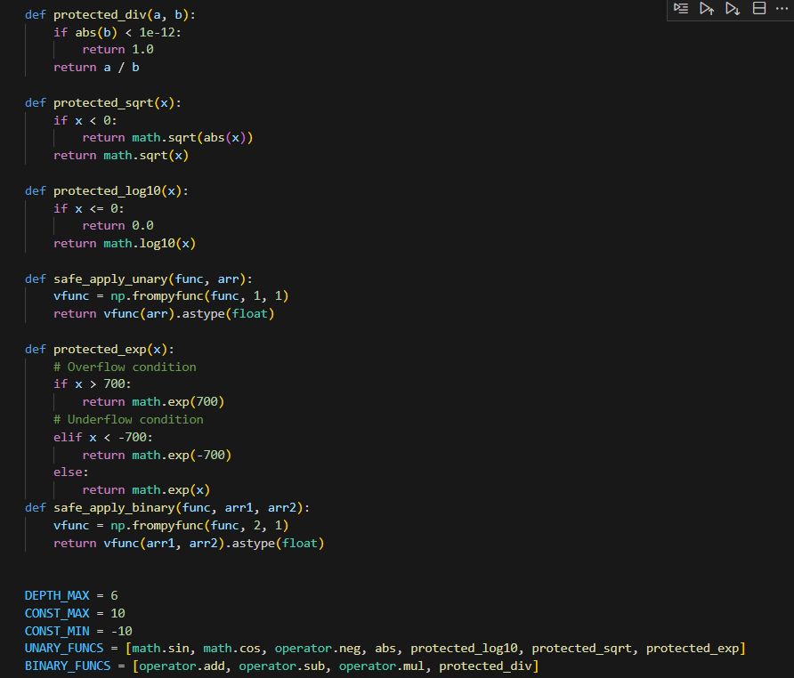

### Tree Creation

The creation of trees uses the recursion paradigm, with `depth == 0` as stop condition:

- `generate_random_tree(depth, constant_min, constant_max)` used to generate a tree with depth `DEPTH_MAX` with variables and constants;
- `generate_random_subtree(depth, constant_min, constant_max)` used to generate a random subtree (without constraints on variables), which can contain only constants or any variables;
- `generate_subtree_forced_var(var, depth, constant_min, constant_max)` used to generate a tree that includes a specific variable `var`.

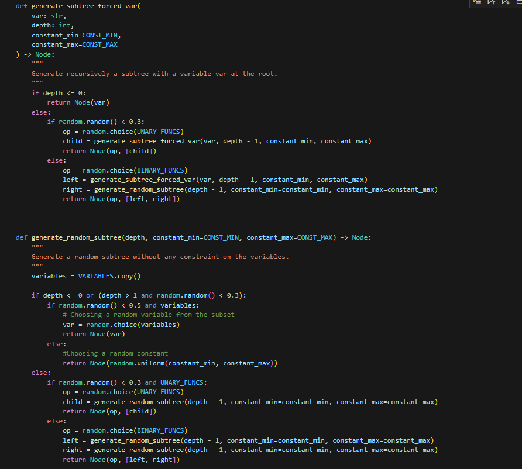

### Expression String

By using the `DISPLAY_NAME_MAP` dictionary the `tree_to_string(node)` function converts a node into a constant, a variable or into an operator (binary or unary). This function is useful for pure representation and plot purposes. 

### Conversion Function

These functions are responsible for converting a tree of mathematical expressions represented with the Node class into a structure compatible with the professor's gxgp library. The result is a GXNode object, which is used in this implementation to plot the expression by `draw` function (defined in gxgp library).

- `make_var_func(var_name)` creates an anonymous function (`lambda`) that returns the value of a variable when called with a dictionary of keyword arguments (`kwargs`);
- `make_const_func(const_val)` creates an anonymous function (`lambda`) that returns a constant value;
- `convert_to_gxgp_node(my_node, subtree=None)` converts a Node node to a GXNode node, keeping the original tree structure.

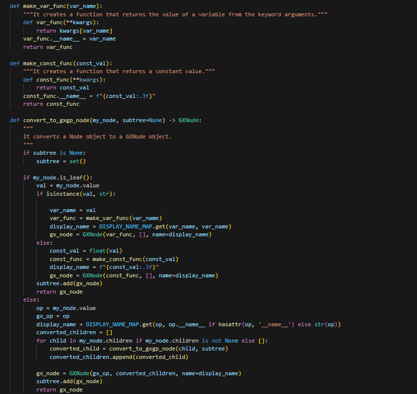

### Fitness and Selection functions

- `fitness(individual, x, y)` calculates the fitness function of the current solution by the Mean Square Error (MSE) between the generated symbolic function and the real data.
- `tournament_selection(population, x, y, k)` implements tournament selection, where 3 individuals are randomly selected and the best one is chosen.

### Crossover functions

The `crossover(parent1, parent2)` function implemented here is used to combine two trees of mathematical expressions (`parent1` and `parent2`) by randomly exchanging some of their sub-expressions. It uses two helper functions:

- `get_all_nodes(tree)` returns in a list all nodes of the tree including the root node and its descendants, exploring it recursively.
- `get_random_node(tree)` selects a node randomly to swap with the other tree.

### Mutation function

The function `mutate(individual, mutation_rate)` implements genetic mutation in a tree of mathematical expressions with a probability equal to mutation rate it decides to mutate an internal node or a leaf node respectively generating a new random subtree (with `generate_random_tree()`) or a variable/constant.

### Cutting the tree function

The `enforce_max_depth(node, max_depth, current_depth)` function limits the maximum depth of a tree by pruning branches that exceed a certain level (`max_depth`). If the current depth (`current_depth`) is greater than or equal to `max_depth`, the node is too deep and should be "pruned". The node is transformed into a leaf, randomly choosing between a variable or a random constant.

### Genetic Programming Algorithm

The function `run_genetic_programming(x, y, population_size, generations, elite_size, max_depth)` implements a Genetic Programming (GP) algorithm to find the best symbolic expression that approximates the data (`x, y`). The process occurs in the following phases, repeated for a number equal to the variable `generations`:
- 1.Initialization of the population with the Ramped Half-and-Half method, which creates half of the population with trees of depth 2 and half of the population with trees of depth 4;
- 2.calculation of the fitness function for each tree and sorting (`fitness(individual, x, y)`);
- 3.selection of the best individuals (in a number defined by elite_size) and saving the best tree of the generation in hall_of_fame, which keeps track of the best trees of each generation;
- 4.selection of k random parents and the two individuals with the lowest MSE are chosen (`tournament_selection(population, x, y, k)`);
- 5.crossover between the two parents (`crossover(parent1, parent2)`);
- 6.mutation of the individual (`mutate(individual, mutation_rate)`);
- 7.depth control (`enforce_max_depth(node, max_depth, current_depth)`);
- 8.adding the generated offspring to the initial population;

### Setting dimensions and Training

To reduce the risk of overfitting the model and the calculation times, as well as to understand more quickly how to modify certain functions and/or parameters to improve the efficiency of the model, training was carried out on 1/10 of the samples, which proved to be especially useful for testing problems number 2, 7 and 8 (i.e. the most complex ones).

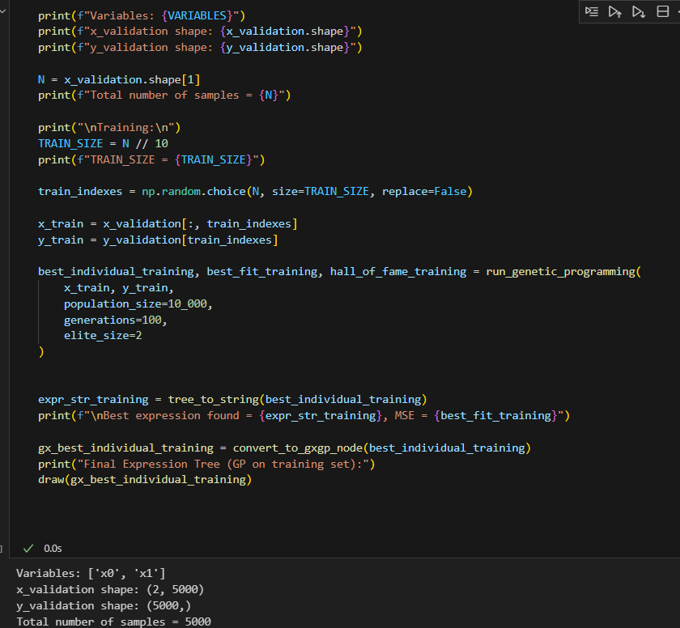

### Test

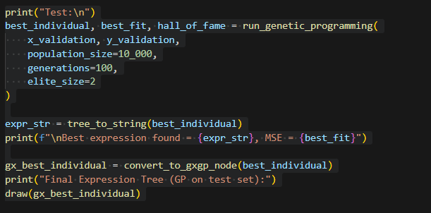

### Results with: population_size = 300, generations = 200, max-depth = 4

To monitor the functioning of the developed algorithm, it started by testing the problem with a population_size value equal to 300 and a max_depth equal to 4

#### Problem 1 Training:
Best expression found = sin(x0), MSE = 7.395570986446985e-34

#### Problem 1 Test:
Best expression found = sin(x0), MSE = 7.125940794232773e-34

#### Problem 2 Training:
Best expression found = ((x0 / exp(-8.817)) / 0.009), MSE = 19516958896576.86

#### Problem 2 Test:
Best expression found = (exp(9.823) * exp((-5.612 / x0))), MSE = 10000000000.0

#### Problem 3 Training:
Best expression found = ((-9.204 * x1) - ((x1 + -8.737) - (x0 * x0))), MSE = 565.8630549529984

#### Problem 3 Test:
Best expression found = (((x2 - 0.694) + x0) - ((x1 - 1.508) * (x1 * x1))), MSE = 583.9606736368345

#### Problem 4 Training:
Best expression found = ((cos(x1) * (0.298 + 6.189)) + 2.498), MSE = 0.6183591607310139

#### Problem 4 Test:
Best expression found = ((cos(x1) * 6.435) + (cos(-1.244) + 2.713)), MSE = 0.2272877060384264

#### Problem 5 Training:
Best expression found = (((x0 * x1) / -(x1)) + x0), MSE = 3.1688404320174867e-18

#### Problem 5 Test:
Best expression found = (log10(-9.204) * (-6.508 / -6.891)), MSE = 5.572810232617333e-18

#### Problem 6 Training:
Best expression found = ((x1 * 1.590) - x0), MSE = 0.5092596857394707

#### Problem 6 Test:
Best expression found = ((x1 / 0.658) + ((x0 / 4.526) - x0)), MSE = 0.17320336270732753

#### Problem 7 Training:
Best expression found = exp(((x1 * x0) + sqrt(1.681))), MSE = 318.449044654525

#### Problem 7 Test:
Best expression found = exp((-(-1.549) * (x0 * x1))), MSE = 367.8480495280366

#### Problem 8 Training:
Best expression found = (((-8.167 * -9.206) + (x5 * x5)) * (x5 * 9.869)), MSE = 8403153.091013353
#### Problem 8 Test:
 
Best MSE: 13743496.21902 => (exp(4.621) * exp(x5))

### Results with different parameters for problems 7 and 8

Since it was observed that problems 7 and 8 had a very high MSE, it was decided to try to test the algorithm with variable parameters of `population_size`, `generations` and `max_depth`, and observe the results obtained with these problems:

#### Problem 7 Training:

Parametri: population_size=300, generations=200, max-depth = 6

Best expression found = (((x0 + sqrt(((2.824 - -8.056) / (x0 - x1)))) + exp((x1 * x0))) + (((x0 * x1) * exp((x1 * x0))) + ((x0 + sqrt((x1 + -2.016))) + 
(x0 * x1))))

MSE = 193.93358690767553

Parametri: population_size=1000, generations=100, max-depth = 6
Best expression found = abs(((((x1 * x0) + (-1.857 / 3.139)) - ((x1 + x0) * ((x1 + x0) / (x0 - x1)))) * sin(x0)))

MSE = 21.88892377370842

Parametri: population_size=10_000, generations=100, max-depth = 6

Best expression found = sqrt(((((x0 + x1) / (x0 - x1)) * ((abs(x0) + sqrt(x1)) * (1.017 - -5.184))) * (exp((x0 * x1)) + abs(x1))))

MSE = 27.219348009205774

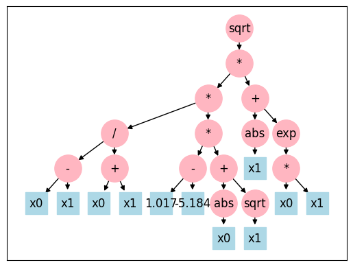

#### Problem 7 Test:

Parametri: population_size=300, generations=200, max-depth = 6

Best expression found = (((exp((x1 * x0)) * (x1 * x0)) + (exp((x1 * x0)) + log10((x0 / x0)))) + sqrt((log10((x1 * x0)) + ((-7.812 / 1.750) / (exp(-6.685) + (x0 - x1))))))

MSE = 275.34648942627786

Parametri: population_size=1000, generations=100, max-depth = 6

Best expression found = (exp((cos(((x0 - x1) * (x1 * -2.682))) + (x1 * x0))) + exp(((x1 * x0) + cos(log10(sqrt(x0))))))

MSE = 248.76723066037152

#### Problem 8 Training:

Parametri: population_size=1000, generations=100, max-depth = 6

Best expression found = ((((x5 * exp(4.414)) * (x5 * x5)) + (((x5 * -8.802) - (x4 - x1)) + (((x4 - -9.156) + cos(x1)) + ((x2 - x2) + (x5 * -7.099))))) + ((((x4 * x4) * (-6.460 * 9.671)) - (x5 * exp(4.414))) + ((x5 * x5) * (x5 * (x5 * x5)))))

MSE = 615621.8553796808

Parametri: population_size=10_000, generations=100, max-depth = 6

Best expression found = (((((x0 - x2) + (log10(x3) / 6.958)) - (((x0 + x0) + (x1 - x1)) + (abs(x4) / exp(-5.592)))) + ((((-2.402 + x4) / (-2.577 - x4)) - ((x3 - x0) + (x2 + x0))) + exp((x5 - -4.545)))) + (((-7.153 - 3.112) / exp(x5)) * (9.192 + log10(((x3 + -6.465) - (x4 + x4))))))

MSE: 530514.53668

#### Problem 8 Test:

Parametri: population_size=1000, generations=100, max-depth = 6

Best expression found = (((((x3 - x5) + (x5 * 9.633)) - (((2.602 + x3) + log10(x2)) - (7.492 * -8.157))) / exp(x5)) + ((exp((4.582 + x5)) + cos((x4 - x3))) + (((7.492 * -8.157) - exp(x5)) - (((x5 + x0) - (x5 - x2)) + (-2.555 * -8.157)))))

MSE = 839853.2588713064

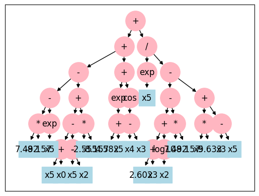

### Results with: population_size = 10_000, generations = 100, max-depth = 6

#### Problem 1 Test:

MSE = 7.125940794232773e-34

Best expression found = sin(x0)

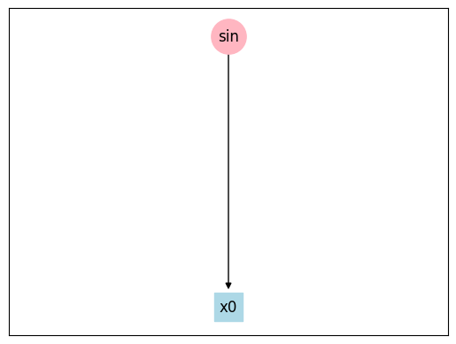

#### Problem 2 Test:

Best expression found = (((exp(((x0 * 4.865) * exp(x1))) * (((-1.527 + -9.650) * (x2 + x1)) / x2)) * abs((5.823 + x0))) - ((x2 - -2.865) / (-9.485 + 5.293)))

MSE = 10000000000.00000

#### Problem 3 Test:

Best expression found = ((((x0 * x0) + (x2 * -4.816)) + (x2 - -3.753)) + ((x0 * x0) + (log10(((2.369 + x1) + -(x1))) + ((x1 * x1) * -(x1)))))

MSE = 0.82978

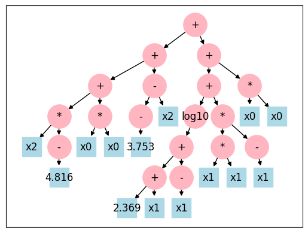

#### Problem 4 Test:

Best expression found = (((cos(x1) * 6.830) + sqrt(sqrt(((-9.009 + x0) + abs(x1))))) + sqrt(sqrt(-8.538)))

MSE = 0.01973

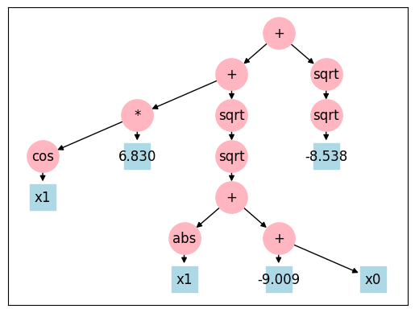

#### Problem 5 Test:

Best expression found = (((((log10(x1) * -9.013) * ((0.309 - -6.337) - sin(x0))) * cos(((x0 / x0) * (-3.695 / x0)))) * sin(log10(x0))) / (exp((-5.465 / -0.213)) - -(3.879)))

MSE = 5.417638189152223e-18

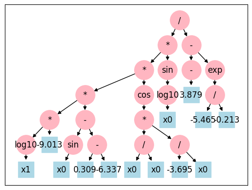

#### Problem 6 Test:

Best expression found = ((((1.396 * x1) + (x0 / -1.418)) - (x1 / -3.781)) - ((exp(-9.845) * (6.017 - x0)) * (((x1 - x0) * ((-4.666 + x0) + (3.425 * -1.858))) * (8.596 - x0))))

MSE = 0.00274

#### Problem 7 Test:

Best expression found = ((abs(4.439) * exp((x1 * x0))) + ((((abs(x0) * abs(x1)) + (abs(x0) * sin(x1))) * cos(((x1 - x0) * (x0 + -7.844)))) * exp((x1 * x0))))

MSE = 255.77055328942862

#### Problem 8 Test:

Best expression found = (abs((x5 * ((9.915 * x5) * ((x4 / x4) * (x5 + x5))))) * x5)

MSE = 1272443.2040473882

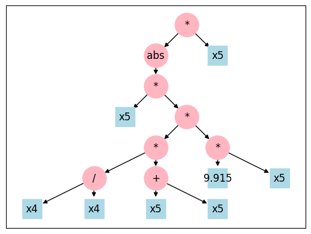

### Expressions found

### Final Result Summary

| Problem | Best_MSE | Expression Found |
|---------|----------|------------------|
| 1       | 7.125940794232773e-34 | sin(x0) |
| 2       | 10000000000.00000 | (((exp(((x0 * 4.865) * exp(x1))) * (((-1.527 + -9.650) * (x2 + x1)) / x2)) * abs((5.823 + x0))) - ((x2 - -2.865) / (-9.485 + 5.293))) |
| 3       | 0.82978 | ((((x0 * x0) + (x2 * -4.816)) + (x2 - -3.753)) + ((x0 * x0) + (log10(((2.369 + x1) + -(x1))) + ((x1 * x1) * -(x1))))) |
| 4       | 0.01973 | (((cos(x1) * 6.830) + sqrt(sqrt(((-9.009 + x0) + abs(x1))))) + sqrt(sqrt(-8.538))) |
| 5       |5.417638189152223e-18 | (((((log10(x1) * -9.013) * ((0.309 - -6.337) - sin(x0))) * cos(((x0 / x0) * (-3.695 / x0)))) * sin(log10(x0))) / (exp((-5.465 / -0.213)) - -(3.879))) |
| 6       | 0.00274 | ((((1.396 * x1) + (x0 / -1.418)) - (x1 / -3.781)) - ((exp(-9.845) * (6.017 - x0)) * (((x1 - x0) * ((-4.666 + x0) + (3.425 * -1.858))) * (8.596 - x0)))) |
| 7       | 255.77055328942862 | ((abs(4.439) * exp((x1 * x0))) + ((((abs(x0) * abs(x1)) + (abs(x0) * sin(x1))) * cos(((x1 - x0) * (x0 + -7.844)))) * exp((x1 * x0)))) |
| 8       | 1272443.2040473882 | (abs((x5 * ((9.915 * x5) * ((x4 / x4) * (x5 + x5))))) * x5) |