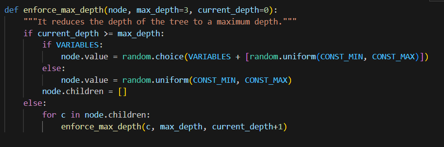
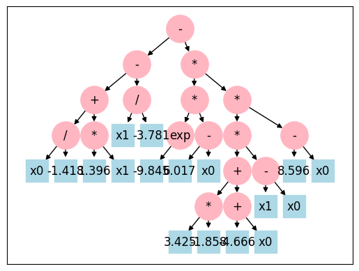

# Computational Intelligence Log- Di Pantaleo Carlo s333106

## Lab1

The goal of the first lab was to solve [Set Cover Problem](https://en.wikipedia.org/wiki/Set_cover_problem).

The Set Cover problem is known to have a complex combinatorial structure with many local minima. Hill Climbing easily gets stuck in one of these minima, while Simulated Annealing, thanks to its ability to accept worse solutions, is able to break out of these minima and continue to explore other areas of the solution space.
The balance between exploration and exploitation offered by Simulated Annealing is particularly suited to problems like Set Cover, where the number of possible combinations is very large and there is no simple path to continuous improvement.

In this solution of the Set Covering Problem it's used a Simulated Annealing algorithm.

### Imports and Parameters
These are the imports and the parameters settings according to the assignment delivery:

| Universe Size | Number of Sets | Density |
|---------------|----------------|---------|
| 100           | 10             | 0.2     |
| 1000          | 100            | 0.2     |
| 10,000        | 1000           | 0.2     |
| 100,000       | 10,000         | 0.1     |
| 100,000       | 10,000         | 0.2     |
| 100,000       | 10,000         | 0.3     |

### Helper functions
The `valid(solution)` function checks whether the solution covers the whole universe, instead the `cost(solution)` function evaluate the solution sum of the costs.

### Simulated Annealing Algorithm

This section contains the Simulated Annealing Algorithm implementation.  The `current_solution` initialization is completely random If `num_sets` is less than 1000, all sets are initially included. Otherwise, each set has a 50% chance of being included. This is to ensure that if the number of sets is low the solution converges more slowly so as to print a more significant graph.

In the simulated annealing algorithm, the acceptance of worse solutions is controlled by an exponential function that depends on the current temperature and the difference in cost between the current solution and the new solution:
\[ P = \exp\left(-\frac{\Delta \text{cost}}{\text{temperature}}\right) \]

This mechanism allows the algorithm to escape local minima and explore the solution space more effectively.

Key Components
- Temperature (`temperature`): The `temperature` is a parameter that controls the probability of accepting worse solutions. It starts at a high value and gradually decreases over time. As the `temperature` decreases, the probability of accepting worse solutions also decreases.
- Cooling Rate (`cooling_rate`): The `cooling_rate` is a factor by which the `temperature` is multiplied at each iteration to gradually reduce it.
It is typically a value slightly less than 1 (e.g., 0.995).

- Cost Difference (`new_cost - current_cost`): The difference in cost between the new solution and the current solution.
If the new solution has a higher cost, this difference is positive.

### Main Execution Flow

This section contains the main execution flow of the implemented algorithm and the plot functions, as depicted in the images above.

### Results

These are the results with `initial_temp=1000.0, cooling_rate=0.995, min_temp=1e-6, max_iter=20_000`, perhaps it could be better decrease the min_temp stop condition in the last three cases, as to be able to observe the settlement of the cost function as the number of iterations increases.

| Universe Size | Number of Sets | Density | #Calls | Cost  |
|---------------|----------------|---------|--------|-------|
| 100           | 10             | 0.2     | 20,001 |257.208|
| 1000          | 100            | 0.2     |  5,040 |6438.395|
| 10,000        | 1000           | 0.2     |   4,194     | 136,067.908    |
| 100,000       | 10,000         | 0.1     |   4,135     |   84203534,662    |
| 100,000       | 10,000         | 0.2     |  4,135   |   182,172,834.586    |
| 100,000       | 10,000         | 0.3     |     4135   |    278,229,367.252   |

#### Universe size = 100, sets number = 10, density = 0.2

#### Universe size = 1000, sets number = 100, density = 0.2

#### Universe size = 10000, sets number = 1000, density = 0.2

#### Universe size = 100000, sets number = 10000, density = 0.1

#### Universe size = 100000, sets number = 10000, density = 0.2

#### Universe size = 100000, sets number = 10000, density = 0.1

collaborators: 
[Lampidecchia Sergio s331080](https://github.com/sergiolampidecchia), [Brizzi Marialuigia 334148](https://github.com/Mars1601)

### Reviews
These are the peer reviews I received about this lab:

### [1-Scrivane](https://github.com/carlopantax/CI2024_lab1/issues/1)

Great job! Your algorithm is a correct implementation of simulated annealing for the set cover problem.

Here are some suggestions for further improving:
You can use a different function to check if a solution is valid or not . Iterate over each taken element of the solution and stop early if you see that all sets are covered, you can slash execution time this way.
(Although that doesn't improve number of calls to fitness function or lower the minimum cost found, it's useful to do faster test in future).
Looking at your graphs, it looks like that for small universe sizes your function gets rapidly to a plateaux , for big ones it never gets there (as you also correctly observed in README) . A way to change that is by
changing maximum number of steps(max_iter) using the universe size information (bigger universe, more steps and smaller universe, less steps) and dropping the early exit for low temperature.
Only decreasing the min_temp stop condition in the last three cases( as you suggested in the README) won't work because you'll get anyway to the maximum number of steps(max_iter=20_000) .

### [2-SaraaFrancee](https://github.com/Blackhand01/CI2024_lab1/issues/2)

I think he did a good job, this simulated annealing is well implemented. In fact, it reachs excellent results relatively in a small number of steps. In particular, it seems to work perfectly for big problems, like last three cases.
Otherwise, for smaller issues I suppose that fewer steps would be sufficient, indeed, for most of them cost does not decrease. In the first two istances, for example, the minimun value is obtained in 1000 steps. So, a little improvement to this algorithm could be to adapt the steps number to the entity of the problem.
A further advice that I can give is to make a table to resume the last significant costs reached or, simply, to print them near the plots.

## Lab1 Reviews

These are the peer reviews I did for this lab:

### [1-Blackhand01](https://github.com/Blackhand01/CI2024_lab1/issues/1)

Generally Speaking the Hill Climbing algorithm is an optimum and fast solution for the Set Cover Problem, even if sometimes the search for a solution might get stuck in a local minimum.
In this case the algorithm starts with a random solution (50% of sets selected), it calculates the coverage and cost of the current solution, then the tweak() function flips one random set from the previous solution and the new solution is accepted if it increases the coverage of the universe, or it maintains the same coverage but it reduces the cost.
I think everything is ok, except for one detail. As indicated in https://en.wikipedia.org/wiki/Set_cover_problem: "Given a set of elements {1, 2, …, n} (called Universe, specifying all possible elements under consideration) and a collection, referred to as S, of a given m subsets whose union equals the universe, the set cover problem is to identify a smallest sub-collection of S whose union equals the universe", however the code accepts a new solution both it improves coverage (covers more items than the current solution), or it maintains the same coverage but reduces the cost, but there is no explicit check whether the coverage reaches 100% of the universe elements. Infact the helper function valid() is never called and np.sum(np.logical_or.reduce(sets[new_solution])) only calculates the current solution coverage, without checking if it covers all the items.

### [2-CappePolito](https://github.com/CappePolito/CI2024_lab1/issues/1)

I believe that using a Simulated Annealing algorithm is a good choice for the Set Cover problem. This regard, in addiction to the usual parameters of this kind of agorithms (like temperature and cooling rate, which allow to escape local minima) I found the use of the patience parameter interesting. It is useful for speeding up the code, increasing the cooling rate if there is no improvement after n iteractions (with n = patience).
The use of clusters with KMeans library is original, they are updated every 100 cycles with the best solution, refocusing the search on a cluster center and diversifying exploration.
I have observed that this code is executed three times for each of the six sets of parameters (UNIVERSE_SIZE, NUM_SETS and DENSITY), using three different semi-greedy methods to generate the first solution: diversity_greedy_start() (which finds a starting solution by maximizing set diversity), last_covered_greedy_start() (which finds a solution by selecting sets that cover the least-covered elements) and random_constrained_greedy_start() (which randomly picks sets while ensuring coverage).
One last detail I noticed is the use of a flip probability, which allows for a more advanced tweak and faster mutation.

## Lab2

The second lab goal is to solve the [Travelling Salesman Problem (TSP)](https://en.wikipedia.org/wiki/Travelling_salesman_problem).

In this solution it is implemented an Evolutionary Algorithm with Simulated Annealing, starting with solutions generated by a greedy algorithm (Nearest Neighbour).

### Imports and File Loading

In this section the `DIST_MATRIX` of dimensions `len(CITIES) * len(CITIES)` was calculated by applying a geographic function that calculates the distance for each combination of cities in the csv file.

### Helper Functions

In this section are defined the helper functions called during the execution of the algorithm:

- `tsp_cost()` function verify that the path selected starts and finishes with the same city and it contains all of the cities in the file csv. After that, `tsp_cost` calculates the sum of the distances between every step of the selected path;
- `Individual` class represents a TSP path with two attributes: `genome` (the order of the visited cities) and the `fitness` (the opposite of the cost);
- `parent_selection()`, selects a random individual;
- `xover()` is a crossover operator that combines the genomes of two parents to produce a child. It copies a subsequence of p1 into the `child_genome`, than it fills the rest of the `child_genome` with unique elements from p2.
- `cycle_crossover()` is called by `xover()` with probability of 50%. It uses an alternative cyclic crossover to produce the child, ensuring that it receives information from both parents and respecting the order of visiting the cities in p1.
- `mutation()` choices a selected segments random number between 3 and 5, it creates all the possibie inversion combinations and with a 30% probability it traslates a segment.

### Greedy Algorithm (Nearest Neighbour)

It generates an initial solution with the euristic Nearest Neighbour, it consists in choosing the closest city to the current one as following step.

### Evolutionary Algorithm

In order to solve the TSP problem with many cities, it would be better choosing an elevated number of `POPULATION_SIZE` and `OFFSPRING_SIZE`.

The `evolve()` function accepts this arguments:
- `population`, a list of individuals (pathways) with their genomes and fitness;
- `generations`, the maximum number of generations for this evolutionary algorithm;
- `mutation_rate`, the initial mutation probability of every individual;
- `cooling rate`, a paramether uses by the Simulated Annealing algorithms in order to reduce the probability of explorate worse solutions after each iteration;
- `stagnation_limit`, the maximum number of iterations without improvements, useful to increase the mutation rate;
- `adaptive_increase`, the adaptive increase after a stagnation period;

Each child of the current generation offspring is generated muting a random parent (with a probability equal to the mutation rate) or with the xover function.
The algorithm is executed a second time, with the best path found the first time also included in the initial population.

### Results

These are the results with `population, generations=200_000, mutation_rate=0.3, initial_temperature=10_000.0, cooling_rate=0.995, stagnation_limit=5_000, adaptive_increase=0.1` for the five files in the cities folder.

## Vanuatu

Final Best Path Cost: 1345.54 km.

## Italy

Final Best Path Cost: 4172.76 km.

## Russia

Final Best Path Cost: 33534.42 km

## USA

Final Best Path Cost: 40728.69 km

## China

Final Best Path Cost: 59990.03 km

collaborators: 
Lampidecchia Sergio s331080 https://github.com/sergiolampidecchia, Brizzi Marialuigia 334148 https://github.com/Mars1601 

### Reviews

These are the peer reviews I received about this lab:

### [1-FruttoCheap](https://github.com/carlopantax/CI2024_lab2/issues/1)

Strengths
Modular Structure: The code is highly modular, with each function handling a specific task, which promotes readability, maintainability, and reusability. For instance, having separate functions for tsp_cost, parent_selection, xover, mutation, etc., is excellent practice.

Effective Logging: By using logging at various levels (debug, info), the code is equipped to provide detailed runtime insights, which is especially useful when debugging or analyzing the solution's behavior over generations.

Greedy Initialization: Incorporating a nearest-neighbor heuristic for generating an initial feasible solution is smart, as it gives the algorithm a reasonably good starting point, potentially speeding up convergence.

Adaptive Mutation Rate: The adaptive mutation rate in response to stagnation is a well-thought-out design choice. It can help the algorithm escape local optima and potentially discover better solutions.

Simulated Annealing: The temperature-based acceptance criterion for new solutions is a good addition, allowing a balance between exploration (accepting worse solutions early on) and exploitation (focusing on better solutions later).

Areas for Improvement
Complexity and Performance Optimization:

Distance Matrix Calculation: The code calculates the full pairwise distance matrix. For large datasets, this becomes memory-intensive and slow. Consider storing only necessary distances or computing them on-demand, especially if the problem size grows significantly.
Population Sorting: Sorting the population by fitness in every generation could be a bottleneck. Consider using a more efficient data structure, like a heap, to maintain the best solutions in constant time.
Class Design and Encapsulation:

TSP as a Class: The code could be more encapsulated by defining a TSP class, which would hold properties like DIST_MATRIX, CITIES, and helper functions like tsp_cost. This would make it easier to manage the different parameters and methods associated with the TSP problem.
Individual Class Expansion: The Individual class could include more functionality, like its own mutation and crossover methods, to make it easier to extend or modify the genetic operations. Right now, mutation and crossover are separate from the individual, which could hinder scalability if new features are added.
Parameter Fine-Tuning:

The number of generations, cooling rate, population size, and mutation rate are hardcoded and may not be optimal for different datasets or cities. Consider implementing adaptive hyperparameter tuning or allowing these parameters to be set dynamically based on the size of CITIES.
Handling of the Stagnation Counter:

The stagnation counter is a good idea, but it currently only influences the mutation rate. It could also be used to trigger re-initialization of part of the population or other diversity-promoting mechanisms if stagnation persists.
Randomness Control and Seed Management:

Using random.seed() at the start of the code would make results reproducible, which is especially useful for debugging or comparing changes. Alternatively, you could pass a seed parameter to the evolve function to make experiments deterministic.
Documentation and Comments:

Although the code is readable, some additional comments or docstrings, especially on function parameters and return values, would make it more understandable for someone unfamiliar with the implementation.
Explain the role of specific parameters like cooling_rate, stagnation_limit, etc., directly in the code as comments or docstrings, particularly in the evolve function.
Suggestions for Additional Features
Dynamic Visualization: The plt plotting currently shows the final history of cost. Adding a dynamic plotting feature that updates every few generations could provide more immediate feedback on the evolution process.

Multi-Objective Optimization:

In some TSP variations, minimizing cost might not be the only objective. Adding multi-objective support (e.g., minimizing time, maximizing scenic value) would make the code more flexible for other TSP-like problems.
Parallelization:

For the selection, mutation, and crossover processes, parallelization using libraries like concurrent.futures could speed up the evolution process, especially for large populations.
Error Handling:

Add exception handling in functions where assumptions about data are made. For instance, if the CITIES file is missing or has incorrect formatting, providing meaningful error messages would make the code more user-friendly.

### [2-EmanueleBarbieri2](https://github.com/carlopantax/CI2024_lab2/issues/2)

I agree with the decision of using greedy for the "fast" algorithm and initializing the evolutionary algorithm's population with the greedy solution. I find interesting the idea of implementing the evolutionary algorithm along with simulated annealing which I believe performs very well. One change I would have made is defining a different number of generations based on the country that the problem is being solved for; perhaps define an acceptable runtime and run the maximum possible number of generations in that time for the specific country. Great work!

### [3-YounessB1](https://github.com/carlopantax/CI2024_lab2/issues/3)

This code is an impressive blend of heuristic and evolutionary techniques to solve the Traveling Salesman Problem. It starts with a solid greedy nearest neighbor approach for initial solutions, followed by a well-implemented crossover and mutation strategy to explore new routes. The adaptive mutation rate and simulated annealing cooling factor add a smart balance between exploration and exploitation. The code is thoughtfully structured with clear logging for progress tracking, and the inclusion of a second evolutionary phase for refinement is a nice touch. Overall, it's a robust and efficient solution with both readability and flexibility in mind.

### [4-anilbayramgogebakan](https://github.com/carlopantax/CI2024_lab2/issues/4)

Firstly, I would say you did a great job by building your modular and very well documented. It seems that you start with nearest neighbours greedy algorithm and then use both mutation and crossover with different probability which is a great way to benefit from both exploration and exploitation. You can try to optimize your hyperparameters such that using different probabilities for mutation or different number of population size in order to improve your solution. In general, it seems a solid work for this task, good job.

## Lab2 Reviews

These are the peer reviews I did for this lab:

### [1-Roberto34](https://github.com/Roberto34/CI2024_lab2/issues/1)

This implementation of a TSP resolution exploits a hill climbing algorithm enhanced by mutation strategies and greedy initializations (NetworkX and Nearest Neighbor).
The use of the NetworkX approximate algorithm designed specifically for the TSP is very smart!
The scramble_mutation (which applies a random mutation to a path by randomly swapping a subset of cities), insert_mutation (which move a city to a new location on the route, reinserting it to create a new sequence), and inversion_mutation (which reverses the sequence of cities between two random locations, creating a new variation in the route) functions introduce variations into the current solution and act as evolutionary operators to generate new path variants. Each of these functions can be passed as parameters to the hill_climber() function, acting as tweak functions within the hill climbing algorithm.
I found the implementation of all these different mutation strategies interesting!
As possible improvements I would suggest at the beginning of the algorithm to generate an initial population with a combination of both greedy and also random paths (which is missing in the code under consideration), similar to a genetic algorithm. Furthermore, I would introduce a cross-over operator that combines path segments between different solutions, generating new solutions based on combinations of paths already explored.
If the algorithm were to get stuck in a local optimum (which is common for hill climbing algorithms) I would use some logic to temporarily accept even worse solutions, in such a way as to increase the degree of exploration (as happens for example for simulated annealing algorithms).

### [2-Pios15](https://github.com/Pios15/CI2024_lab2/issues/3)

In this implementation of a TSP resolution a greedy algorithm (based on the nearest neighbor) is used to generate half of the initial solutions for the evolutionary algorithm (the remaining half is generated randomly), a fair compromise to have at the same time both genetic variety, that solutions that start from a good margin of optimality, great choice!!
I find interesting the local_search() function, which applies a local search to improve the path, calculating the cost of a route by adding the distances between subsequent cities on the route, with the calculate_cost() function.
The evolutionary algorithm employs an Invert-Over Cross-over function, which mixes two paths, randomly selecting two nodes, inverting segments or exchanging nodes between them and a mutate() function, which with a certain probability (mutation_rate), exchanges two city ​​on the route.
In addiction using a mutation rate that reduces over time (mutation_rate = max(0.01, mutation_rate * 0.99)) is a good approach to avoid exploring too randomly in later generations.
As possible improvements, in order to find solutions closer to the optimum solution, I suggest the use of a mutation function that allows a greater degree of exploration such as a rotation of route segments, or the replacement of a segment with a solution found by another part of the population.

## Lab3

In order to solve the [n-puzzle problem](https://en.wikipedia.org/wiki/15_puzzle#:~:text=The%20n%20puzzle%20is%20a,Note%20that%20both%20are%20admissible.) it is used an A* algorithm with heuristic function the Manhattan distance and the number of misplaced tiles.

### Imports and Parameters Setting

### Helper Functions

- `available_actions()` returns a list of valid moves that can be performed from the current position of the empty square;

- `do_action()` makes a move on the current state of the puzzle, returning a new state;

- `goal_positions` precalculates the target positions for each value in the puzzle, to speed up the calculation of heuristics using the divmod() function;

- `heuristic()` computes a heuristic value to estimate the remaining cost to reach the goal state via the parameters Manhattan distance and number of misplaced tiles;

They are called in `solve_puzzle()` in order to solve the puzzle using the A* algorithm;

### A* Algorithm

This algorithm solves the puzzle problem using the A* algorithm with a priority queue. 
The goal is to find the shortest path (in terms of moves) to get the puzzle from an initial state to a goal state `[1,2, ..., n-1, 0]`.

### Main Execution Flow

To ensure that the initial puzzle can be traced back to the final form of the problem (is solvable), the final solution to the problem is messed up by choosing a number of random moves, dictated by the `RANDOMIZE_STEPS` parameter.
The number of `RANDOMIZED_STEPS` indicated is 150 and allows you to have a starting solution with a good level of randomization especially with `PUZZLE_DIM <= 8`, for larger dimensions it is inevitably necessary to increase the number of `RANDOMIZED_STEPS`, to the detriment of performance in terms of time.

### Reviews

This is the peer review I received about this lab:

### [1-Giorgio-Galasso](https://github.com/carlopantax/CI2024_lab3/issues/1)

Hi Carlo,
here’s my review of your code!

I want to start by saying that I immediately understood your code: it’s very straightforward and clean. The algorithm you used is A*, the right choice for this type of problem.

The heuristic you implemented is interesting, as it returns not only the Manhattan distance but also twice the number of misplaced tiles. Clearly, this improves performance.

The algorithm is fairly standard, but the only suggestion I can make is to run some tests and see how the code behaves with a higher number of RANDOMIZE_STEPS. You could then adapt the algorithm to make it more efficient, perhaps by further improving the heuristic function (which is critical for A*). For example, you might try an h that overestimates the cost to the goal.

These are my thoughts on your code: keep it up! 💪

## Lab3 Reviews

These are the peer reviews I did for this lab:

### [1-Giorgio-Galasso](https://github.com/Giorgio-Galasso/CI2024_lab3/issues/1)

The following code represents an excellent solution to the n-puzzle problem with an implementation of the A* algorithm.
The heuristic used combines the Manhattan distance and the number of misplaced tiles (Good choice!) to estimate the cost of the solution, it includes an exponential parameter (exp) which makes the estimation more aggressive, but this could be improved by better balancing the combination of Manhattan and out-of-position tiles.
A heapq is used for storing states, especially useful for efficient management of the priority queue.
The MAX_STEP limit seems arbitrary and may not be sufficient for complex puzzles, A dynamic timeout system would be more appropriate.
I really appreciated the subdivision of the problem into several independent functions, it makes the code more readable and configurable, especially for finding the position of the 0 (empty tile) (find_zero), generating the valid subsequent states (get_neighbors) and for reconstructing the path from starting node to target node (reconstruct_path).

### [2-Gpir0](https://github.com/Gpir0/CI2024_lab3/issues/2)

This code implements an advanced solution to the N-puzzle problem using two main approaches: A* (Classical search algorithm) and A Bidirectional*(Good idea!), which is a variant that searches from both the initial state and the target state.
The heuristic used is the classic Manhattan distance for each tile with respect to its target position.
I really appreciated the subdivision of the problem into several independent functions, it makes the code more readable and configurable, especially to track the states visited (explored_states), to reconstruct the solution path (parent_map) and to store the route costs for each stat (state_cost).
One thing I noticed is that storing states happens as tuples (rather than serializing them with .tobytes()), which may be less efficient (but they are only details).

The implementation of bidirectional A* represents a significant addition in terms of efficiency (Well done!).

A* bidirectional performs two parallel searches:

- from the initial state towards the target.
- from the target towards the initial state.

It uses two priority queues and two cost maps, when the two searches meet (one state is present in both explorations) the stopping condition of the algorithm occurs.

## Lab4 - Project Work

The Project Work goal is implementing a Genetic Programming (GP) algorithm for the [Symbolic Regression](https://en.wikipedia.org/wiki/Symbolic_regression), that is, an evolutionary method that tries to find a mathematical function that best approximates a set of data. The algorithm relies on parse trees to represent mathematical expressions.

### Loading Data and Tree Node Definition
The main object is the `Node` class, which represents a node in the tree. The `value` of each node can be:
- a constant (number);
- a variable (e.g. x0, x1);
- a binary operator (e.g. +, -, *, /).
- an unary operator (e.g. sin, cos, log10).

The `is_leaf()` function returns true if the node does not have any child (it is a leaf).

### Node Evaluation

The `evaluate(node, x)`function computes the numerical value of a mathematical expression represented as a parse tree, given an input vector `x`, which contains the values set for each variable.

### Protected Operators and Parameters Settings

This section shows some safe functions, which allow to apply mathematical functions safely on the input vectors:

- `protected_div(a, b)` returns a/b or `1.0` default value (if `b` is less than a numeric underflow value);
- `protected_sqrt(x)` returns the `math.sqrt(x)` value even if `x` is less than `0` (using its absolute value);
- `protected_log(x)` returns the `math.log(x)` value even if `x` is less or equal than `0` (using its absolute value);
- `protected_exp(x)` returns the `math.exp(x)` value even if `x` is less or equal than `-700` or `x` is greater than `700`, avoiding underflow and overflow errors; 
- `safe_apply_unary(func, arr)` chooses the `func` in the `UNARY_FUNCS` array and it applies the respective unary function;
- `safe_apply_biary(func, arr1, arr2)` chooses the `func` in the `BINARY_FUNCS` array and it applies the respective binary function;
- `DEPTH_MAX` is a parameter which binds the tree generated by `generate_random_tree()` to have a maximum depth;
- `CONST_MAX` e `CONST_MIN` serve to limit the range of numeric values ​​that can be used in the tree nodes during the random generation of mathematical expressions.

### Tree Creation

The creation of trees uses the recursion paradigm, with `depth == 0` as stop condition:

- `generate_random_tree(depth, constant_min, constant_max)` used to generate a tree with depth `DEPTH_MAX` with variables and constants;
- `generate_random_subtree(depth, constant_min, constant_max)` used to generate a random subtree (without constraints on variables), which can contain only constants or any variables;
- `generate_subtree_forced_var(var, depth, constant_min, constant_max)` used to generate a tree that includes a specific variable `var`.

### Expression String

By using the `DISPLAY_NAME_MAP` dictionary the `tree_to_string(node)` function converts a node into a constant, a variable or into an operator (binary or unary). This function is useful for pure representation and plot purposes. 

### Conversion Function

These functions are responsible for converting a tree of mathematical expressions represented with the Node class into a structure compatible with the professor's gxgp library. The result is a GXNode object, which is used in this implementation to plot the expression by `draw` function (defined in gxgp library).

- `make_var_func(var_name)` creates an anonymous function (`lambda`) that returns the value of a variable when called with a dictionary of keyword arguments (`kwargs`);
- `make_const_func(const_val)` creates an anonymous function (`lambda`) that returns a constant value;
- `convert_to_gxgp_node(my_node, subtree=None)` converts a Node node to a GXNode node, keeping the original tree structure.

### Fitness and Selection functions

- `fitness(individual, x, y)` calculates the fitness function of the current solution by the Mean Square Error (MSE) between the generated symbolic function and the real data.
- `tournament_selection(population, x, y, k)` implements tournament selection, where 3 individuals are randomly selected and the best one is chosen.

### Crossover functions

The `crossover(parent1, parent2)` function implemented here is used to combine two trees of mathematical expressions (`parent1` and `parent2`) by randomly exchanging some of their sub-expressions. It uses two helper functions:

- `get_all_nodes(tree)` returns in a list all nodes of the tree including the root node and its descendants, exploring it recursively.
- `get_random_node(tree)` selects a node randomly to swap with the other tree.

### Mutation function

The function `mutate(individual, mutation_rate)` implements genetic mutation in a tree of mathematical expressions with a probability equal to mutation rate it decides to mutate an internal node or a leaf node respectively generating a new random subtree (with `generate_random_tree()`) or a variable/constant.

### Cutting the tree function

The `enforce_max_depth(node, max_depth, current_depth)` function limits the maximum depth of a tree by pruning branches that exceed a certain level (`max_depth`). If the current depth (`current_depth`) is greater than or equal to `max_depth`, the node is too deep and should be "pruned". The node is transformed into a leaf, randomly choosing between a variable or a random constant.

### Genetic Programming Algorithm

The function `run_genetic_programming(x, y, population_size, generations, elite_size, max_depth)` implements a Genetic Programming (GP) algorithm to find the best symbolic expression that approximates the data (`x, y`). The process occurs in the following phases, repeated for a number equal to the variable `generations`:
1- Initialization of the population with the Ramped Half-and-Half method, which creates half of the population with trees of depth 2 and half of the population with trees of depth 4;
2- calculation of the fitness function for each tree and sorting (`fitness(individual, x, y)`);
3- selection of the best individuals (in a number defined by elite_size) and saving the best tree of the generation in hall_of_fame, which keeps track of the best trees of each generation;
4- selection of k random parents and the two individuals with the lowest MSE are chosen (`tournament_selection(population, x, y, k)`);
5- crossover between the two parents (`crossover(parent1, parent2)`);
6- mutation of the individual (`mutate(individual, mutation_rate)`);
7- depth control (`enforce_max_depth(node, max_depth, current_depth)`);
8- adding the generated offspring to the initial population;

### Setting dimensions and Training

To reduce the risk of overfitting the model and the calculation times, as well as to understand more quickly how to modify certain functions and/or parameters to improve the efficiency of the model, training was carried out on 1/10 of the samples, which proved to be especially useful for testing problems number 2, 7 and 8 (i.e. the most complex ones).

### Test

### Results with: population_size = 300, generations = 200, max-depth = 4

To monitor the functioning of the developed algorithm, it started by testing the problem with a population_size value equal to 300 and a max_depth equal to 4

#### Problem 1 Training:
Best expression found = sin(x0), MSE = 7.395570986446985e-34

#### Problem 1 Test:
Best expression found = sin(x0), MSE = 7.125940794232773e-34

#### Problem 2 Training:
Best expression found = ((x0 / exp(-8.817)) / 0.009), MSE = 19516958896576.86

#### Problem 2 Test:
Best expression found = (exp(9.823) * exp((-5.612 / x0))), MSE = 10000000000.0

#### Problem 3 Training:
Best expression found = ((-9.204 * x1) - ((x1 + -8.737) - (x0 * x0))), MSE = 565.8630549529984

#### Problem 3 Test:
Best expression found = (((x2 - 0.694) + x0) - ((x1 - 1.508) * (x1 * x1))), MSE = 583.9606736368345

#### Problem 4 Training:
Best expression found = ((cos(x1) * (0.298 + 6.189)) + 2.498), MSE = 0.6183591607310139

#### Problem 4 Test:
Best expression found = ((cos(x1) * 6.435) + (cos(-1.244) + 2.713)), MSE = 0.2272877060384264

#### Problem 5 Training:
Best expression found = (((x0 * x1) / -(x1)) + x0), MSE = 3.1688404320174867e-18

#### Problem 5 Test:
Best expression found = (log10(-9.204) * (-6.508 / -6.891)), MSE = 5.572810232617333e-18

#### Problem 6 Training:
Best expression found = ((x1 * 1.590) - x0), MSE = 0.5092596857394707

#### Problem 6 Test:
Best expression found = ((x1 / 0.658) + ((x0 / 4.526) - x0)), MSE = 0.17320336270732753

#### Problem 7 Training:
Best expression found = exp(((x1 * x0) + sqrt(1.681))), MSE = 318.449044654525

#### Problem 7 Test:
Best expression found = exp((-(-1.549) * (x0 * x1))), MSE = 367.8480495280366

#### Problem 8 Training:
Best expression found = (((-8.167 * -9.206) + (x5 * x5)) * (x5 * 9.869)), MSE = 8403153.091013353
#### Problem 8 Test:
 
Best MSE: 13743496.21902 => (exp(4.621) * exp(x5))

### Results with different parameters for problems 7 and 8

Since it was observed that problems 7 and 8 had a very high MSE, it was decided to try to test the algorithm with variable parameters of `population_size`, `generations` and `max_depth`, and observe the results obtained with these problems:

#### Problem 7 Training:

Parametri: population_size=300, generations=200, max-depth = 6

Best expression found = (((x0 + sqrt(((2.824 - -8.056) / (x0 - x1)))) + exp((x1 * x0))) + (((x0 * x1) * exp((x1 * x0))) + ((x0 + sqrt((x1 + -2.016))) + 
(x0 * x1))))

MSE = 193.93358690767553

Parametri: population_size=1000, generations=100, max-depth = 6
Best expression found = abs(((((x1 * x0) + (-1.857 / 3.139)) - ((x1 + x0) * ((x1 + x0) / (x0 - x1)))) * sin(x0)))

MSE = 21.88892377370842

Parametri: population_size=10_000, generations=100, max-depth = 6

Best expression found = sqrt(((((x0 + x1) / (x0 - x1)) * ((abs(x0) + sqrt(x1)) * (1.017 - -5.184))) * (exp((x0 * x1)) + abs(x1))))

MSE = 27.219348009205774

#### Problem 7 Test:

Parametri: population_size=300, generations=200, max-depth = 6

Best expression found = (((exp((x1 * x0)) * (x1 * x0)) + (exp((x1 * x0)) + log10((x0 / x0)))) + sqrt((log10((x1 * x0)) + ((-7.812 / 1.750) / (exp(-6.685) + (x0 - x1))))))

MSE = 275.34648942627786

Parametri: population_size=1000, generations=100, max-depth = 6

Best expression found = (exp((cos(((x0 - x1) * (x1 * -2.682))) + (x1 * x0))) + exp(((x1 * x0) + cos(log10(sqrt(x0))))))

MSE = 248.76723066037152

#### Problem 8 Training:

Parametri: population_size=1000, generations=100, max-depth = 6

Best expression found = ((((x5 * exp(4.414)) * (x5 * x5)) + (((x5 * -8.802) - (x4 - x1)) + (((x4 - -9.156) + cos(x1)) + ((x2 - x2) + (x5 * -7.099))))) + ((((x4 * x4) * (-6.460 * 9.671)) - (x5 * exp(4.414))) + ((x5 * x5) * (x5 * (x5 * x5)))))

MSE = 615621.8553796808

Parametri: population_size=10_000, generations=100, max-depth = 6

Best expression found = (((((x0 - x2) + (log10(x3) / 6.958)) - (((x0 + x0) + (x1 - x1)) + (abs(x4) / exp(-5.592)))) + ((((-2.402 + x4) / (-2.577 - x4)) - ((x3 - x0) + (x2 + x0))) + exp((x5 - -4.545)))) + (((-7.153 - 3.112) / exp(x5)) * (9.192 + log10(((x3 + -6.465) - (x4 + x4))))))

MSE: 530514.53668

#### Problem 8 Test:

Parametri: population_size=1000, generations=100, max-depth = 6

Best expression found = (((((x3 - x5) + (x5 * 9.633)) - (((2.602 + x3) + log10(x2)) - (7.492 * -8.157))) / exp(x5)) + ((exp((4.582 + x5)) + cos((x4 - x3))) + (((7.492 * -8.157) - exp(x5)) - (((x5 + x0) - (x5 - x2)) + (-2.555 * -8.157)))))

MSE = 839853.2588713064

### Results with: population_size = 10_000, generations = 100, max-depth = 6

#### Problem 1 Test:

MSE = 0.00000

Best expression found = sin(x0)

#### Problem 2 Test:

Best expression found = (((exp(((x0 * 4.865) * exp(x1))) * (((-1.527 + -9.650) * (x2 + x1)) / x2)) * abs((5.823 + x0))) - ((x2 - -2.865) / (-9.485 + 5.293)))

MSE = 10000000000.00000

#### Problem 3 Test:

Best expression found = ((((x0 * x0) + (x2 * -4.816)) + (x2 - -3.753)) + ((x0 * x0) + (log10(((2.369 + x1) + -(x1))) + ((x1 * x1) * -(x1)))))

MSE = 0.82978

#### Problem 4 Test:

Best expression found = (((cos(x1) * 6.830) + sqrt(sqrt(((-9.009 + x0) + abs(x1))))) + sqrt(sqrt(-8.538)))

MSE = 0.01973

#### Problem 5 Test:

Best expression found = ((-8.599 + ((-9.087 + -1.618) * (x1 + 2.066))) / exp(((x1 / x1) * (5.382 * 6.624))))

MSE = 0.00000

#### Problem 6 Test:

Best expression found = ((((1.396 * x1) + (x0 / -1.418)) - (x1 / -3.781)) - ((exp(-9.845) * (6.017 - x0)) * (((x1 - x0) * ((-4.666 + x0) + (3.425 * -1.858))) * (8.596 - x0))))

MSE = 0.00274

#### Problem 7 Test:

Best expression found = ((abs(4.439) * exp((x1 * x0))) + ((((abs(x0) * abs(x1)) + (abs(x0) * sin(x1))) * cos(((x1 - x0) * (x0 + -7.844)))) * exp((x1 * x0))))

MSE = 255.77055328942862

#### Problem 8 Test:

Best expression found = (abs((x5 * ((9.915 * x5) * ((x4 / x4) * (x5 + x5))))) * x5)

MSE = 1272443.2040473882

### Final Result Summary

| Problem | Best_MSE | Expression Found |
|---------|----------|------------------|
| 1       | 0.00000 | sin(x0) |
| 2       | 10000000000.00000 | (((exp(((x0 * 4.865) * exp(x1))) * (((-1.527 + -9.650) * (x2 + x1)) / x2)) * abs((5.823 + x0))) - ((x2 - -2.865) / (-9.485 + 5.293))) |
| 3       | 0.82978 | ((((x0 * x0) + (x2 * -4.816)) + (x2 - -3.753)) + ((x0 * x0) + (log10(((2.369 + x1) + -(x1))) + ((x1 * x1) * -(x1))))) |
| 4       | 0.01973 | (((cos(x1) * 6.830) + sqrt(sqrt(((-9.009 + x0) + abs(x1))))) + sqrt(sqrt(-8.538))) |
| 5       | 0.00000 | ((-8.599 + ((-9.087 + -1.618) * (x1 + 2.066))) / exp(((x1 / x1) * (5.382 * 6.624)))) |
| 6       | 0.00274 | ((((1.396 * x1) + (x0 / -1.418)) - (x1 / -3.781)) - ((exp(-9.845) * (6.017 - x0)) * (((x1 - x0) * ((-4.666 + x0) + (3.425 * -1.858))) * (8.596 - x0)))) |
| 7       | 255.77055328942862 | ((abs(4.439) * exp((x1 * x0))) + ((((abs(x0) * abs(x1)) + (abs(x0) * sin(x1))) * cos(((x1 - x0) * (x0 + -7.844)))) * exp((x1 * x0)))) |
| 8       | 1272443.2040473882 | (abs((x5 * ((9.915 * x5) * ((x4 / x4) * (x5 + x5))))) * x5) |